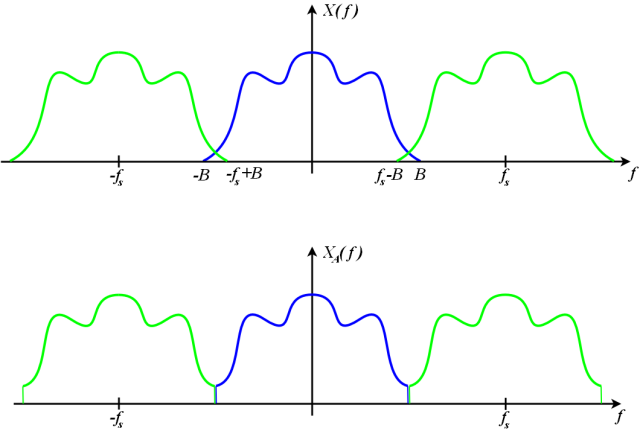

% SDR with GNU Radio
% Ray Rischpater, KF6GPE kf6gpe@arrl.net | kf6gpe.org  
% BayCon 2020, 8 February 2020

# What we're talking about today
* What's GNU Radio?
* A very basic introduction to SDR
* A word on hardware
* Getting GNU Radio
* GNU Radio Companion
* Writing Modules

# What's GNU Radio?
* Free & open source software
* Provides signal-processing blocks to build software-defined radios
* Works with readily available hardware
* Runs on Linux (best), Windows and macOS
* Runs on both Intel & ARM (including Raspberry Pi!)
* Used in hobby and commercial applications

# A very basic introduction to SDR
* Uses digital representations of signals 
* Uses lots of math to implement things like modulation & filters

# Sampling a signal
* Analog signals sampled periodically
* Sample rates should be at least twice maximum frequency (Nyquist theorem)

# Sampling a signal

# Sampling a signal - things to look out for
* Tradeoff between sample rate & computing requirements
* Tradeoff between cost, sample rate, and sample resolution
* Aliasing

# A word on sampling
* More samples mean more expensive A/D converters
* More samples means more computing power to process the samples
* Faster sampling means higher cost

# A word on resolution
* The number of discrete steps measurable in the range of a signal
* Higher resolution generally means higher cost A/D converters
* Sometimes a lower noise lower-resolution A/D is better than a higher resolution A/D!

# Aliasing in sampling

# Aliasing in the frequency domain

# Filtering
* Uses signal processing on the digitally sampled signal
* Requires fast processsing for additions & multiplications
* Digital filters can often create far steeper cutoffs for the same component cost

# Filtering: finite impulse response filter

# Filtering: Infinite impulse response filter

# Modulation
* More math!
* e.g., AM can be accomplished multiplying the carrier by the audio signal
* e.g., BPSK can be accomplished by changing the phase of the carrier
* Other modulations possible, too!

# Demodulation
* Still more math!
* Additional use of signal processing can provide symbol recovery, error detection & timing synchronization

# Block diagram of a typical SDR

# A word on hardware
* You need a moderately fast PC or Raspberry Pi running Linux, Windows, or macOS
* For RF experiments, you need some sort of SDR hardware
* [RTL-SDR](http://www.rtl-sdr.com) is a cheap receiver (check the raffle table!) 
* [hackRF](https://greatscottgadgets.com/hackrf/) is a popular transceiver
* [LimeSDR](https://limemicro.com/products/boards/limesdr/) is another newer transceiver
* Lots of other choices; just check for GNU Radio compatibility first

# What does GNU Radio give me?
* Over 400 DSP blocks, including filters, modulators, demodulators, visualization tools
* Flow-based construction of radios & subsystems
* The ability to add new blocks with code in Python or C++
  

# Getting GNU Radio
* On Linux, use your package manager
* On Windows, use an installer
* On macOS, use MacPorts
* Did I mention that it's open source! You can also build from the source code
* See the [GNU Radio Wiki](https://wiki.gnuradio.org/index.php/InstallingGR) for more details
  
# GNU Radio Companion
* Drag and drop construction of SDRs using modules
* Uses a data-flow paradigm for connecting modules
* Provides controls and visualization tools

# Modeling SDRs using flow diagrams
* Radio components connected by signal paths
* Each signal is a stream of numbers
* Modules transform the number streams in some way
* Sources provide data, sinks acccept it

# Modules and variables
* Most elements of your radio are functional blocks that do something
* Variables hold numbers (frequencies, sample rates, etc)
* Modules get connections, variables just sit there.

# Graphical User Interface components
* Some sinks display data (e.g., waterfall)
* Some GUI controls to set things like variables (e.g., knobs)

# Basic use
* Drag and drop modules
* Click to create data flow connections
* Control-F is your friend (finds modules)

# A simple broadcast FM receiver

# The radio source

https://wiki.gnuradio.org/index.php/Guided_Tutorial_PSK_Demodulation

Raspberry Pi 2 or beyond should work
